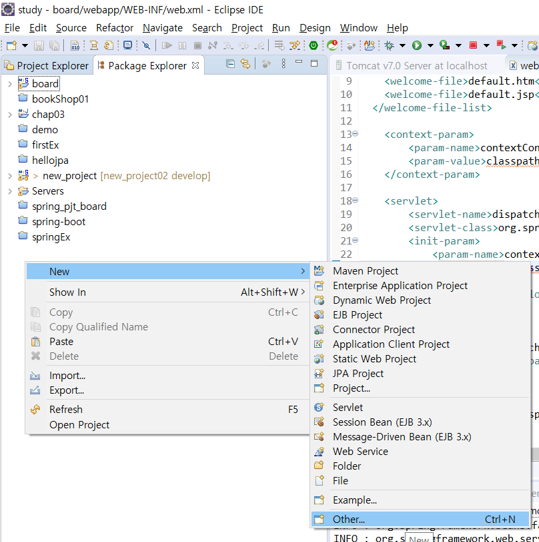
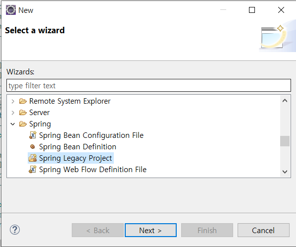
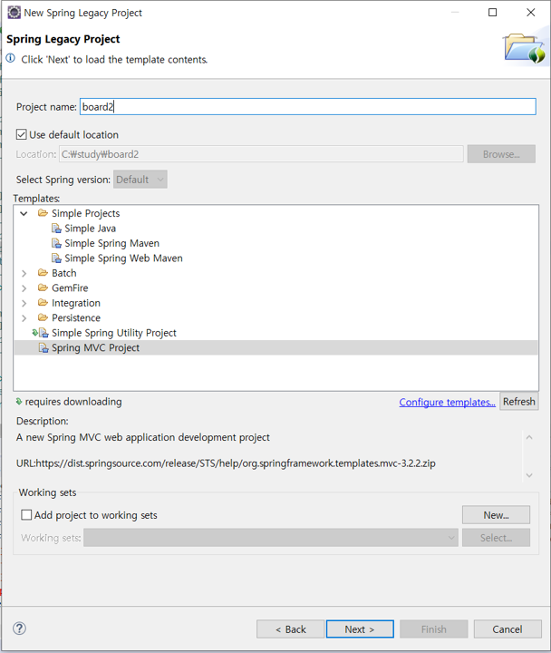
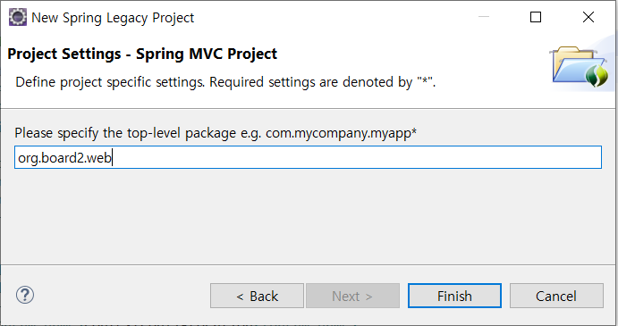
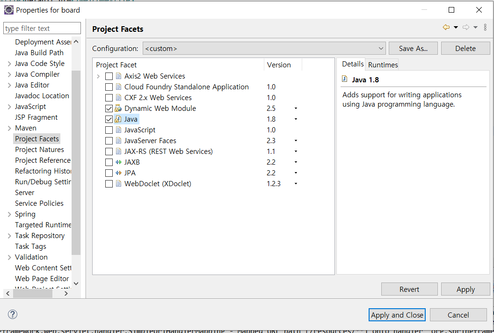
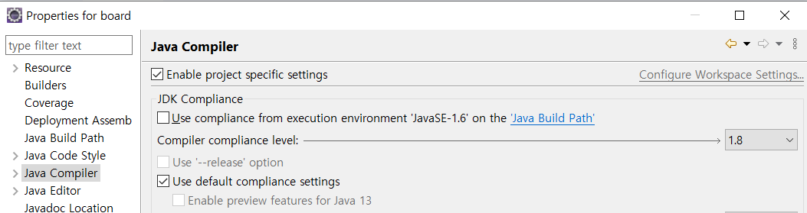
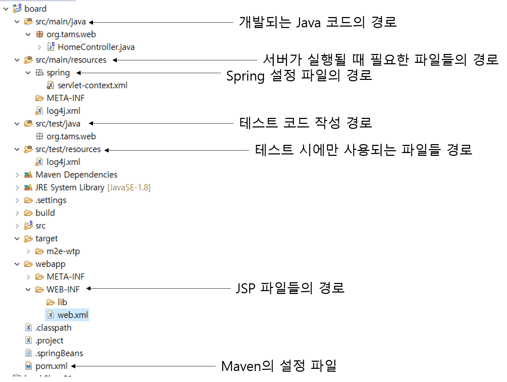
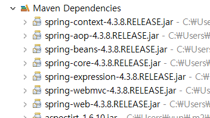

## 이클립스에서 스프링 MVC 프로젝트 만들기
#### 1. 프로젝트 생성






스프링 프로젝트는 기본적으로 프로젝트 생성 시 지정하는 패키지의 마지막 경로가 웹 어플리케이션의 루트 경로가 된다. 'org.board.web'으로 설정했으므로 브라우저 상에서 경로는 'http://localhost:8282/web'이 된다.

#### 2. JDK 버전 처리
프로젝트 우클릭 Properties로 들어간다.




#### 스프링 MVC 프로젝트 템플릿의 구조


프로젝트 구조를 Package Expoloer로 변경하자

#### 스프링 버전 변경하기
```xml
<properties>
    <java-version>1.8</java-version>
    <org.springframework-version>4.3.8.RELEASE</org.springframework-version>
    <org.aspectj-version>1.6.10</org.aspectj-version>
    <org.slf4j-version>1.6.6</org.slf4j-version>
</properties>
```
아래 그림에서 변경된 스프링 버전으로 바뀌었는지 확인한다.


