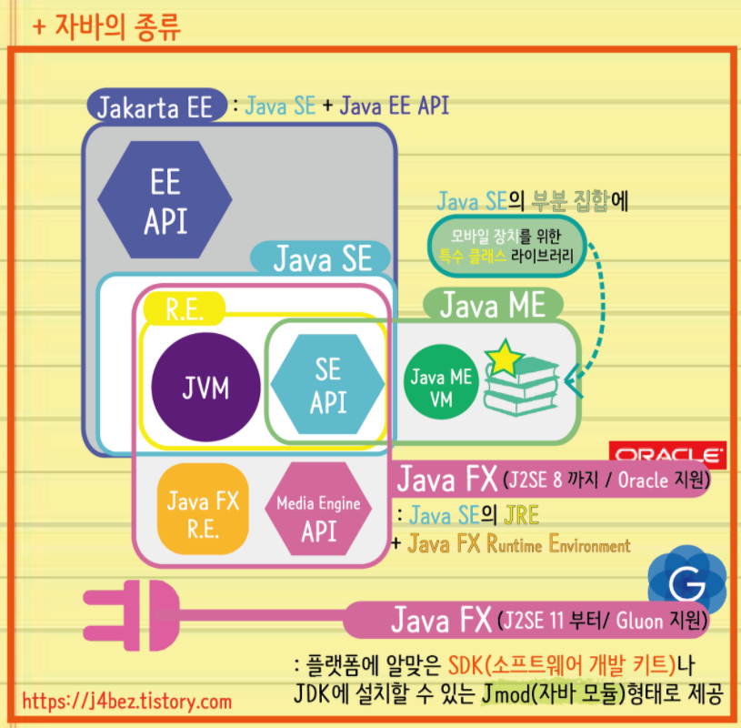

## 자바se와 자바ee란 무엇인가
- 자바 se란? Standard Edition
자바 se는 자바 API 집합체(패키지)이다. 우리가 사용하는 자바 언어를 말한다. 스윙, gui 프로그램을 만들 때 사용한다. 패키지로는 java.lang, java.io 등이 있다.

- 자바ee란 jsp, servlet이 포함되며 이 것을 이용해서 jdbc나 was같은 기업용 애플리케이션을 개발하는데 사용된다. 자바 se를 바탕으로 ee가 존재한다.
